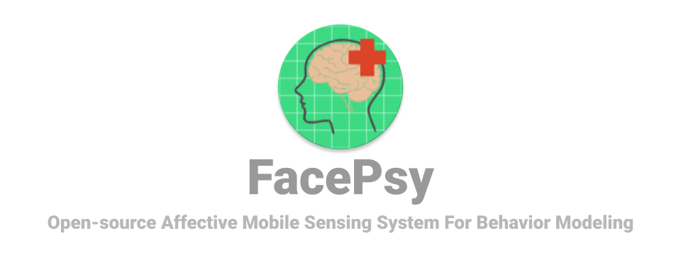
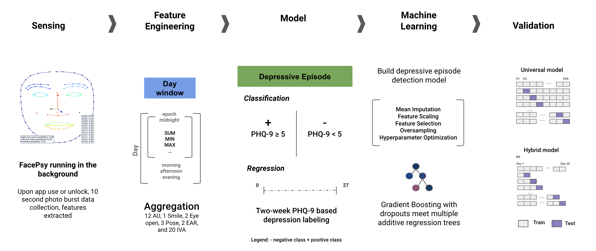
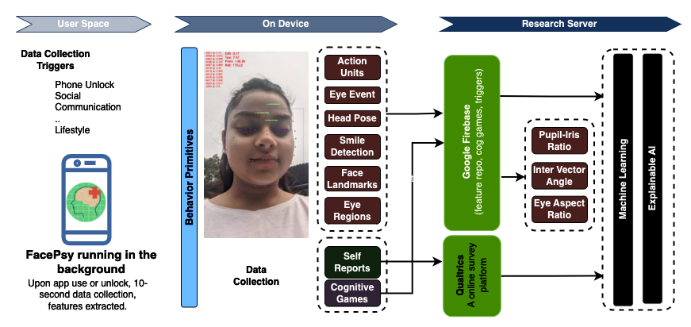

FacePsy is designed to capture real-time facial behavior primitives as users interact with their mobile devices.

> This is the official codebase of the affective mobile sesning system paper [FacePsy: An Open-Source Affective Mobile Sensing System - Analyzing Facial Behavior and Head Gesture for Depression Detection in Naturalistic Settings](https://dl.acm.org/doi/10.1145/3676505), accepted by [ACM International Conference on Mobile Human-Computer Interaction (MobileHCI 2024)](https://mobilehci.acm.org/2024/).

# News 📰
> Our work mood detection using pupillary response got accepted at [IEEE-EMBS BSN 2024](https://bsn.embs.org/2024/), titled [MoodPupilar: Predicting Mood Through Smartphone Detected Pupillary Responses in Naturalistic Settings](https://arxiv.org/abs/2408.01855).

## Depression Study In-the-Wild


## Introduction


## Functionalities:
* Real-time facial behavior primitives (e.g. AU, head pose, facial expressions) tracking
* App usage tracking (e.g. screen on/off, app open/close)
* Cognitive assessment (e.g. Stroop, Visual Spatial Memory, etc.)
* Custom EMA delivery
* Data collection can be done in the background
* Use triggers such as screen on/off, app open/close, etc. to start/stop data collection
* Realtime feature extraction of facial behavior primitives, and stores them remote database
* Reboot app on device restart, app crash, etc, and continue data collection

## Requirements
1. Install JDK 1.8, e.g. [Amazon Corretto 8](https://docs.aws.amazon.com/corretto/latest/corretto-8-ug/downloads-list.html)
2. Install [Jetbrains Toolbox](https://www.jetbrains.com/toolbox-app/)
3. Install [Android Studio 2022.1](https://developer.android.com/studio/releases/past-releases/as-electric-eel-release-notes) via Jetbrains Toolbox.
4. Install NDK v20.0.5594570 via Android Studio.
5. Install CMake v3.6 via Android Studio.
6. Download and extract [OpenCV v4.0.1 for Android](https://github.com/opencv/opencv/releases/tag/4.0.1).

## Firebase Setup
1. Open [Firebase Console](https://console.firebase.google.com/) and create a new project.
2. Register the android app to your Firebase project.
3. Download `google-services.json` file and copy it to `./FacePsy/app/` directory.
4. Go back to your Firebase Project, select `Authentication`, and enable `Email/Password`.
5. Go back to your Firebase Project, select `Cloud Firestore` and click `Create Database`.

### Firetore Rules

Replace and modify as needed the rule with following config.

```
rules_version = '2';

service cloud.firestore {
  match /databases/{database}/documents {
    match /{document=**} {
      allow read, write: if request.auth != null;
    }
  }
}
```

### Firestore Data

- Collection `config`
  - Document `survey` (`db.collection("config").document("survey")`)
    - `preLink`: https://example.com/
    - `postLink`: https://example.com/
  - Document `triggers` (`db.collection("config").document("triggers")`)
  - Document `triggerDuration` (`db.collection("config").document("triggerDuration")`)
    - `app`: 100
    - `flowerGame`: 100
    - `unlockEvent`: 100
    - `stroopTask`: 100
  - Document `stroopTask` (`db.collection("config").document("stroopTask")`)
    - `rounds`: 3

## Installation
1. Clone the repository
2. Before importing the project into AndroidStudio there's a __little editing__ to do:
   * Open the `app/CMakeLists.txt`
   * Then, __replace__ with your path the variables **PROJECT_PATH** and **OPENCV_PATH**.
3. Open the project in Android Studio
4. Set the NDK path in `local.properties` file
5. Set JDK version to 1.8 by going to Preference > Build Tools > Gradle
6. Add Firebase to the project (Follow the instructions [here](https://firebase.google.com/docs/android/setup))
7. Build the project

## Usage
1. Open the app
2. Create an account, or login if you already have an account
3. App will ask for permissions to access the camera, storage, etc.
4. App registers itself in background services, and starts collecting data based on the triggers

## Study Admin/Researcher/Developer
The study admin/researcher/developer can access the data collected by the app by logging into the firebase console. The firebase console is available at [FacePsy Web Portal](https://console.firebase.google.com/)

Following parameters can be accessed by the study admin/researcher/developer:
1. Customizable triggers
2. EMA link and delivery
3. Data collection length on each trigger type
4. Data collection frequency

## Credit
Thanks to [CottaCush/HiddenCam](https://github.com/CottaCush/HiddenCam).

## Citation
If you find this repository useful, please consider giving a star :star: and citation using the given BibTeX entry:
```
@article{10.1145/3676505,
author = {Islam, Rahul and Bae, Sang Won},
title = {FacePsy: An Open-Source Affective Mobile Sensing System - Analyzing Facial Behavior and Head Gesture for Depression Detection in Naturalistic Settings},
year = {2024},
issue_date = {September 2024},
publisher = {Association for Computing Machinery},
address = {New York, NY, USA},
volume = {8},
number = {MHCI},
url = {https://doi.org/10.1145/3676505},
doi = {10.1145/3676505},
month = sep,
articleno = {260},
numpages = {32},
keywords = {affective computing, application instrumentation, depression, empirical study that tells us about people, field study, machine learning, mobile computing, system}
}
```

## License

This project is licensed under the MIT License.

## Contact

If you have any questions or suggestions, please feel free to contact [Rahul](mailto:rahul.islam3@gmail.com).

